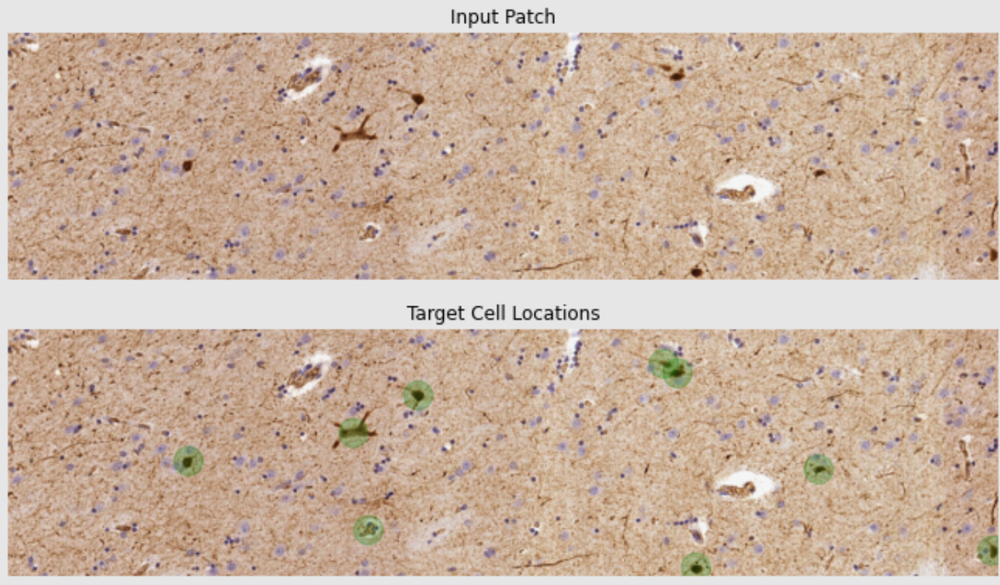
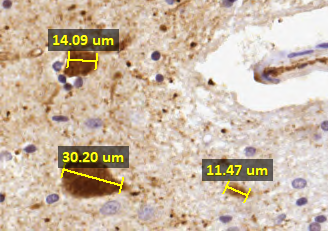
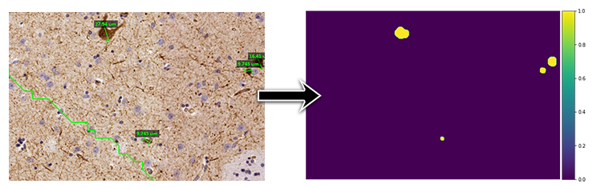
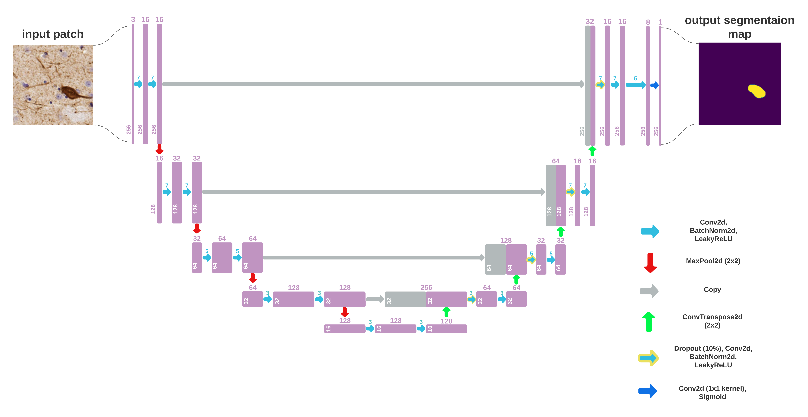
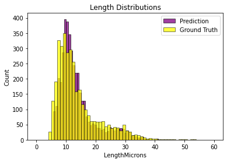
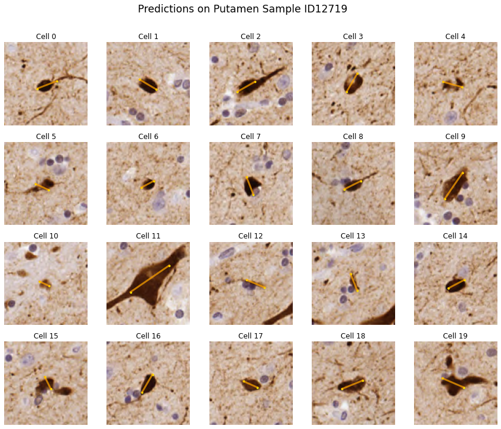

# Calretinin-Positive Neuron Detection

## History

This is a project my friend Amir Deitch and I worked on in 2022, in collaberation with neuroscientist Doctor Paz Kelmer from Semmelweis University in Budapest. The project was submitted as part of a data science workshop Amir and I took in Spring 2022 at OUI, and graded 100 / 100. The project was first uploaded to GitHub in July 2024. The entirety of our work is detailed in the associated Jupyter notebook, `calretinin-positive-neuron-detection.ipynb`.

## Background

The project centers around the problem of detecting specific types of neurons named _calretinin-positive (CR+) neurons_ in whole-slide scans of immunohistochemistry-stained (IHC) samples of _the putamen_ - a structure inside a group of nuclei in the human brain called _the basal ganglia_. These neurons were of interest to Doctor Kelmer's team, whose research aimed to confirm a correlation between their size-distribution in the putamen, and the presence of _schizophrenia_ - a serious chronic neuropsychiatric disorder for which there existed no available objective biomarkers (current diagnosis methods depended upon the subjective clinicians' opinion only).

The goal of the project was to aid the research of Doctor Kelmer's team, by automaticallly detecting calretinin-positive neurons in whole-slide scans of putamen samples, and collecting their size-distribution. This could significantly speed-up the research process by skipping the need to manually mark the neurons.

In the project, we explore the problem from a data-driven perspective, experiementing and analyzing several methods to solve it. The final system is based on deep learning methods applied in conjunction with classical image processing techniques.

## Final Solution Overview

Given a whole-slide-scan of IHC-stained putamen samples, we split the task into two parts:

1. **Localization:** finding the CR+ cells in the image by collecting a set of coordinates within them:

2. **Marking:** for each such cell, stretching a line across its largest axis and determining its size:

We begin by devising a method for generating a segmentation map of input images, seperating pixels associated with CR+ cells from the background, _assuming we have access to the cells' localization in it_. This method is based on classical image-processing techniques:

Using this method, the second task of _marking_ becomes easy - just pick the longest axis along the cell's outline.

We use our method for devising segmentation maps to generate a dataset, and train a U-Net to predict them:

Finally, we apply this network to predict segmentation maps, and assume its connected components represent cells. We take the centers of mass of those connected-components as the cells' localization, and apply the above-mentioned marking algorithm to complete the task.

## Qualitative Evaluation

We compare the distribution of CR+ cells' sizes between the ground-truth markings and our method's predictions on unseen data, and achieve a similar distribution:

Examining the detected cells individually, reveals expected behavior:

